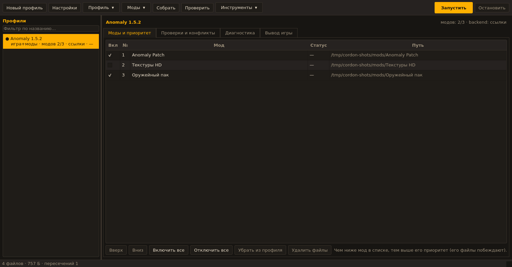
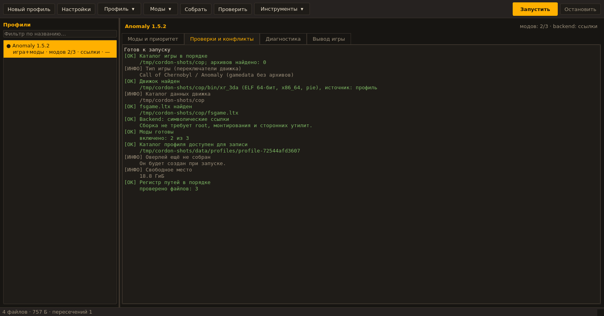

# CORDON-LINUX

**Лаунчер профилей и модов S.T.A.L.K.E.R. для Linux с адаптацией под движок [OpenXRay](https://github.com/OpenXRay/xray-16).**

Это порт [CORDON](https://github.com/ITzSYUK/CORDON) (WPF, .NET 8, Windows) на Python + Qt (PySide6).
Подробное руководство: **[docs/USER_GUIDE_LINUX_RU.md](docs/USER_GUIDE_LINUX_RU.md)**,
устройство порта: **[docs/TECHNICAL_LINUX_EN.md](docs/TECHNICAL_LINUX_EN.md)**.
Идея, формат профилей, порядок модов и «чем ниже в списке — тем выше приоритет» сохранены,
Windows-специфичная часть (USVFS, NTFS-жёсткие ссылки, реестр) заменена на нативные
Linux-механизмы: символические ссылки, `fuse-overlayfs` и ключи командной строки OpenXRay.

```
profiles/profile-<id>/            $fs_root$ для движка
├── fsgame.ltx                    подготовленная копия (исходный fsgame.ltx не изменяется)
├── gamedata/                      объединённое дерево: данные движка → игра → моды (последний побеждает)
├── db/mods/                       модовые архивы *.db, подключённые модами
├── patches/, bin/, ...            корневые ссылки на файлы игры и движка
└── _appdata_/                     логи, сохранения, скриншоты, shaders_cache этого профиля
```

Запуск выглядит так:

```bash
/usr/games/xr_3da -fsltx ~/.local/share/cordon/profiles/profile-<id>/fsgame.ltx \
                  -overlaypath ~/.local/share/cordon/profiles/profile-<id>/_appdata_ \
                  -cs
```

* `-fsltx` (OpenXRay) делает каталог профиля корнем файловой системы движка,
* `-overlaypath` переносит `$logs$` и `$app_data_root$` внутрь профиля,
* `-cs` добавляется автоматически для ресурсов «Чистого неба» (CoP — режим движка по умолчанию),
* рабочей директорией процесса тоже становится профиль.

---

## Скриншоты





## Возможности

| Раздел | Что есть |
|---|---|
| Профили | создание, копирование, удаление; «игра+моды» и «готовая сборка»; отдельные логи/сохранения у каждого профиля; учёт времени игры |
| Моды | добавление папок, поиск модов в каталоге, установка из `zip`/`7z`/`rar`/`tar.*` в управляемое хранилище, включение/отключение, порядок приоритета перетаскиванием, удаление вместе с файлами |
| Конфликты | статус каждого мода (перекрывает / перекрыт / смешанный / полностью перекрыт), список пересекающихся файлов, итоговое дерево «кто побеждает», исключение отдельных файлов из оверлея |
| Проверки | пред-полётная проверка перед запуском, вкладка «Проверки и конфликты», команда `cordon doctor` |
| Linux-специфика | аудит чувствительности к регистру (создаёт ссылки-алиасы), `ldd`-проверка библиотек движка, XDG-каталоги, отсутствие требований к root |
| MO2 | импорт порядка и включённости модов из `modlist.txt` Mod Organizer 2, подключение папки `overwrite` |
| Прочее | Discord Rich Presence (UNIX-сокет), портативный режим, экспорт/импорт профиля в JSON, отчёты, журнал лаунчера с ротацией, тёмная (PDA) и светлая темы |

## Требования

* Linux x86_64, Python **3.11+** (для GUI — PySide6).
* Нативная сборка **OpenXRay** (xray-16) под Linux — из репозитория, из пакета вашего дистрибутива
  или из portable-архива. Windows-сборки (`.exe`) не поддерживаются: нужен ELF-файл `xr_3da`.
* Данные игры: `gamedata/` и/или архивы `gamedata.db*` + `fsgame.ltx` (CoP 1.6.02, CS 1.5.10,
  CoC/Anomaly 1.4.x и производные). Движок OpenXRay не поддерживает Тень Чернобыля — для SoC нужна
  другая сборка движка.

Полезные системные утилиты (по желанию):

| Утилита | Зачем | Debian/Ubuntu | Arch | Fedora |
|---|---|---|---|---|
| `fuse-overlayfs` + `fusermount3` | backend «fuse-overlayfs» | `fuse3 fuse-overlayfs` | `fuse3 fuse-overlayfs` | `fuse3 fuse-overlayfs` |
| `7z` | `.7z` архивы | `p7zip-full` | `p7zip` | `p7zip p7zip-plugins` |
| `unrar` | `.rar` архивы | `unrar` | `unrar` | `unrar` |
| `xdg-open` | открытие каталогов | `xdg-utils` | `xdg-utils` | `xdg-utils` |

## Установка

> Порт влит в основную ветку (`main`), поэтому обычный `git clone` даёт актуальное дерево.
> Если ваш клон сделан раньше — обновите его: `git pull`. Проверить, что дерево то самое:
> `ls install.sh src/cordon` (в старых копиях, где только Windows-лаунчер, их нет).

### Вариант 1: скрипт (без прав root)

```bash
git clone https://github.com/defaultdj/CORDON-LINUX.git
cd CORDON-LINUX
./install.sh                 # в ~/.local
# ./install.sh --system      # в /usr/local (через sudo)
# ./install.sh --prefix ~/opt/cordon
# ./install.sh --no-gui      # без PySide6 (только CLI)
```

Установка без клонирования репозитория (когда нужен только CLI; apt/venv уже готовы):

```bash
pipx install "cordon-linux @ git+https://github.com/defaultdj/CORDON-LINUX.git"
```

Скрипт создаёт приватное виртуальное окружение, ставит пакет (с PySide6, если получается),
прописывает `cordon`/`cordon-gui` в `PATH` и добавляет пункт меню.

### Вариант 2: pipx / pip

```bash
pipx install "cordon-linux[gui] @ git+https://github.com/defaultdj/CORDON-LINUX.git"
# или из локальной копии (внутри клонированного каталога):
python3 -m venv ~/.venvs/cordon && ~/.venvs/cordon/bin/pip install ".[gui]"
```

### Вариант 3: сборка пакета дистрибутива

* Arch: `cd packaging/arch && makepkg -si`
* Debian/Ubuntu (черновая заготовка, требует проверки на месте):
  скопируйте `packaging/debian` в корень репозитория и выполните `dpkg-buildpackage -b -uc`.

## Быстрый старт

```bash
cordon tools                       # что найдено в системе (движок, утилиты, Discord)
cordon new "Anomaly 1.5.2" --game ~/games/anomaly    # создать профиль
cordon mod-add "Anomaly 1.5.2" ~/Downloads/Mods      # добавить моды (папки или архивы)
cordon prepare "Anomaly 1.5.2"                       # собрать оверлей профиля
cordon launch  "Anomaly 1.5.2" --dry-run             # посмотреть итоговую команду
cordon doctor  "Anomaly 1.5.2"                       # проверки перед запуском
cordon launch  "Anomaly 1.5.2"                       # играть
```

Или графически: `cordon-gui` (пункт «CORDON-LINUX» в меню приложений).

## Способы подключения модов (backend)

| Backend | Как работает | Плюсы | Минусы |
|---|---|---|---|
| `link` (по умолчанию) | в каталоге профиля строится дерево символических ссылок на файлы модов | без root, без FUSE, работает везде (включая Tmpfs/ext4/btrfs), переживает перезагрузку | часть игр с античитом/спец-загрузчиками не любит ссылки (для S.T.A.L.K.E.R. не проблема) |
| `fuse-overlayfs` | настоящее наложение слоёв, точки монтирования `gamedata` | максимально «честная» файловая система для движка | нужны `fuse-overlayfs` и `fusermount3`, монтирование живёт только во время сессии |
| `direct` | ничего не собирается, профиль просто указывает движку данные | мгновенно | конфликты решает сам движок, порядок приоритетов не гарантируется |

Переключение: «Настройки профиля» → «Способ сборки» или `cordon edit <профиль> --backend fuse-overlayfs`.

## Адаптация под OpenXRay

* **`-fsltx`** — профиль становится `$fs_root$`. `fsgame.ltx` в каталоге игры **никогда не изменяется**:
  рядом с профилем создаётся копия, где `$app_data_root$` указывает внутрь профиля (или в общую
  папку игры, если выбрано «общие данные»).
* **`-overlaypath`** — логи, сохранения, скриншоты и `shaders_cache` профиля попадают в
  `profiles/profile-<id>/_appdata_`. Из-за особенностей `CLocatorAPI::_initialize` каталог
  `_appdata_` создаётся заранее.
* **Переключатель игры** — `-cs` для Clear Sky (в OpenXRay есть только ресурсы CoP/CS/CoC).
* **Флаги движка** — `-nosplash`, `-no_gamepad`, `-i`, `-dedicated`, `-gl`, `-savescreenshots`,
  `-silent_error_mode`, `-nolog` доступны чекбоксами; дополнительные аргументы можно вписать строкой.
  Неизвестные ключи лаунчер подсвечивает в проверках (список — из `misc/linux/bash-completion` движка).
* **Библиотеки** — если `xr_3da` не запускается из-за отсутствующих `lib*.so`, лаунчер сообщает
  об этом (`ldd`), а portable-сборки получают свой каталог в начале `LD_LIBRARY_PATH`.
* **Регистр путей** — в Linux VFS движка регистр имеет значение (`xr_fs_strlwr` на Linux — заглушка).
  Поэтому есть аудит: лаунчер ищет в `.ltx/.xml/.script/.lua` ссылки, которые не совпадают с диском
  по регистру, и по кнопке создаёт ссылки-алиасы (`gamedata/Textures -> textures`). Алиасы
  запоминаются в `<профиль>/.cordon-aliases.json` и восстанавливаются после каждой пересборки.
* **Установка из репозитория** — `/usr/games/xr_3da`, данные в `/usr/share/openxray`, deb-пакеты
  `openxray_cop/openxray_cs`. Лаунчер сам находит такой движок (`--game` можно не указывать,
  если сборка лежит рядом), поддерживает и portable-раскладку (`bin/xr_3da`, `bin_x64/`, `engine/`).

## Команды CLI

| Команда | Назначение |
|---|---|
| `cordon list` / `new` / `show` / `edit` / `duplicate` / `delete` | профили |
| `cordon mods` / `mod-add` / `mod-scan` / `mod-install` / `mod-state` / `mod-move` / `mod-remove` | моды |
| `cordon prepare` | собрать оверлей профиля (`--force` — пересобрать) |
| `cordon launch [--dry-run] [--detach] [--skip-check] [--presence]` | запуск игры |
| `cordon doctor [--json]` | предполётные проверки |
| `cordon conflicts [--tree]` | конфликты и итоговое дерево |
| `cordon audit [--fix]` | аудит регистра путей |
| `cordon fsgame` | показать подготовленный `fsgame.ltx` |
| `cordon import-mo2 <профиль> <путь> [--apply]` | импорт из Mod Organizer 2 |
| `cordon export` / `import` | обмен профилями (JSON) |
| `cordon report`, `cordon open`, `cordon unmount`, `cordon tools`, `cordon gui` | сервисные команды |

Общие ключи: `--config-dir`, `--data-dir`, `--portable <каталог>`, `--json`, `-v`.

## Каталоги

| Что | Путь (по умолчанию) | Переопределение |
|---|---|---|
| Настройки | `~/.config/cordon/settings.json` | `--config-dir`, `CORDON_CONFIG_DIR` |
| Профили, моды | `~/.local/share/cordon/` | `--data-dir`, `CORDON_DATA_DIR` |
| Кэш | `~/.cache/cordon/` | `--cache-dir`/`CORDON_CACHE_DIR` |
| Журнал лаунчера | `~/.cache/cordon/launcher.log` (1 МиБ + 1 архив) | — |
| Всё в одном каталоге | `cordon --portable /path/to/dir` | создаёт `config/`, `data/`, `cache/` рядом |

Настройки пишутся атомарно и под блокировкой (`flock`); повреждённый файл сохраняется в
`recovery/<имя>.<метка>.json`, есть резервная копия `settings.backup.json`.

## Диагностика

| Симптом | Что делать |
|---|---|
| «Исполняемый файл движка не найден» | укажите каталог движка в настройках профиля или задайте `executable_relative` (например `/usr/games/xr_3da` для deb-сборки) |
| «Не хватает библиотеки движка» | доустановите пакеты, от которых зависит `xr_3da` (`ldd /usr/games/xr_3da` покажет список) |
| Пустой экран/краш на старте, в логе «cannot find texture» | запустите `cordon audit "<профиль>" --fix` (регистр путей) и посмотрите `_appdata_/logs/xray_*.log` |
| Мод «полностью перекрыт» | его файлы целиком замещаются модами ниже по списку — можно выключить |
| Discord-статус не появляется | Presence выключен по умолчанию; включите его в настройках, клиент Discord должен быть запущен в этой же сессии |
| Игра не видит сохранения | проверьте «Данные игры» в настройках профиля: `Внутри профиля` (по умолчанию) или `Общая папка игры` |
| Ошибка `Exec format error` | файл движка не ELF (это Windows-сборка) либо не отмечен как исполняемый (`chmod +x`) |
| Оверлей не монтируется | поставьте `fuse-overlayfs`/`fuse3`, либо переключитесь на backend «ссылки» |
| Нужно вернуть чистую игру | `cordon delete "<профиль>"` — удаляет только каталог профиля и распакованные моды, папки модов остаются на месте |

## Разработка

```bash
python3 -m venv .venv && .venv/bin/pip install -e ".[gui,dev]"
.venv/bin/python -m pytest tests/cordon -q      # 155 тестов (ядро, CLI, GUI, интеграция с реальным процессом);
                                               # GUI-тесты пропускаются, если нет PySide6/libGL
.venv/bin/ruff check src tests                  # линтер (если установлен)
```

Структура:

```
src/cordon/
├── core/      # вся логика без GUI: пути, ELF, fsgame, слои, оверлей, моды, конфликты, проверки,
│              # аудит регистра, запуск, настройки, сервисный слой, Discord
├── gui/       # PySide6: главное окно, таблица модов, диалоги, темы, фоновые задачи
└── cli.py     # консольный интерфейс (cordon)
tests/cordon/  # pytest: мини-установка игры/движка/модов в tmp_path
```

Ядро не импортирует PySide6 — CLI, GUI и тесты используют один и тот же сервисный слой
(`cordon.core.service.CordonService`). Интеграционные тесты запускают
`/usr/bin/true` в роли движка, поэтому реально проверяются сборка оверлея, `Popen`,
захват вывода и коды возврата.

## Лицензия

GPL-3.0, как и у оригинального CORDON. Оригинал: <https://github.com/ITzSYUK/CORDON>.
Движок: <https://github.com/OpenXRay/xray-16>.
